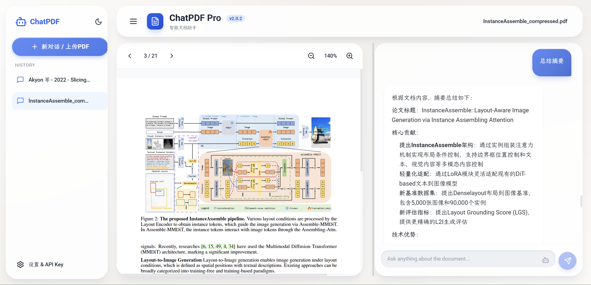

# ChatPDF Pro v3.0.0

<div align="center">


[](LICENSE)
[](https://reactjs.org)
[](https://www.python.org)

**Smart Document Assistant - Chat with your PDFs** · [中文](README.md)

[Quick Start](#quick-start) • [Features](#core-features) • [What's New in v3.0](#whats-new-in-v30) • [Tech Stack](#tech-stack) • [Configuration](#configuration)

</div>

---

## App Preview



*Professional PDF reading and AI chat interface with native PDF rendering, conversation history, and intelligent text extraction*

### One-Click Start


> `start.bat` / `start.sh` automatically checks for updates, installs dependencies, starts both backend and frontend, and opens the browser. Close the terminal to stop all services.

---

## What's New in v3.0

### 🧠 Semantic Groups
- **Smart Aggregation** - Merges text chunks into ~5000-character semantically coherent units, respecting page, heading, and table boundaries
- **Three-Level Granularity** - Each group auto-generates summary (80 chars), digest (1000 chars), and full text representations
- **LLM Summaries** - AI-generated high-quality summaries and keywords, with automatic fallback to text truncation on failure

### 🎯 Smart Granularity Selection
- **Query Intent Detection** - Automatically classifies questions as overview, extraction, analytical, or specific
- **Dynamic Granularity Matching** - Overview questions get more groups with summaries; detail questions get fewer groups with full text
- **Mixed Granularity Retrieval** - Top-ranked groups get full text, next ones get digest, the rest get summary

### 💰 Token Budget Management
- **Language-Aware Estimation** - Chinese at 1.5 chars/token, English at 4 chars/token for accurate estimation
- **Smart Degradation** - When budget runs low, downgrades granularity (full→digest→summary) instead of dropping content
- **Answer Reservation** - Automatically reserves 1500 tokens for LLM response generation

### 🔍 Advanced Search
- **Regex Search** - Use `/regex:` prefix for regular expression matching
- **Boolean Search** - Support AND, OR, NOT logical operators
- **Context Snippets** - Each result includes surrounding context

### ⚡ Preset Questions & Visualization
- **Quick Actions** - Preset buttons for "Summarize", "Key Formulas", "Research Methods", etc.
- **Mind Maps** - AI generates structured Markdown mind maps
- **Flowcharts** - AI generates Mermaid syntax flowcharts, auto-rendered in the frontend

### 📎 Citation Tracking
- **Reference Numbers** - AI responses automatically include [1] [2] citation markers
- **Click to Navigate** - Click citation numbers to jump to the corresponding PDF page
- **Source Verification** - Easily verify the accuracy of AI responses

### 📊 Retrieval Observability
- **Structured Logging** - Records query type, hit sources, token usage for every retrieval
- **Fallback Tracking** - Automatically logs degradation reasons (LLM failure, missing index, etc.)
- **Debug Info** - API responses include retrieval_meta field for troubleshooting

---

## Core Features

### PDF Document Processing
- **Native PDF Rendering** - High-fidelity display via PDF.js with zoom, pagination, and text selection
- **Smart Text Extraction** - High-quality extraction using pdfplumber with complex layout support
- **Table Recognition** - Automatic detection and extraction of tables into structured text
- **Page-by-Page Indexing** - Per-page extraction and indexing with precise page navigation
- **Adjustable Zoom** - 50%-200% smooth zoom with reading preference adaptation

### AI Chat
- **Multi-Model Support** - OpenAI, Anthropic, Google Gemini, Grok, Ollama, and more
- **Context-Aware Q&A** - Intelligent answers based on document content with accurate citations
- **Streaming Output** - Real-time typewriter-style responses with adjustable speed
- **Markdown Rendering** - Full support for code highlighting, math formulas (KaTeX), tables, lists
- **Mermaid Rendering** - Auto-detects and renders Mermaid flowchart code blocks
- **Conversation History** - Auto-saves chat records, supports switching and deleting sessions

### Intelligent Retrieval (v3.0 Upgrade)
- **Semantic Groups** - Aggregates chunks into semantically complete groups with three granularity levels
- **Dual-Index Search** - Queries both chunk-level and group-level FAISS vector indexes simultaneously
- **BM25 + Vector Hybrid** - Keyword matching and semantic understanding complement each other via RRF fusion
- **Smart Granularity Selection** - Automatically picks the best detail level based on question type
- **Token Budget Management** - Language-aware context length control with smart degradation

### Visual Analysis
- **Screenshot Capture** - Full-page or area selection screenshots for multimodal AI analysis
- **Chart Recognition** - GPT-4V, Claude Sonnet, and other vision models understand charts, formulas, diagrams
- **Multimodal Q&A** - Combined text and image analysis

### User Interface
- **Healing Blue Design** - Modern blue-white UI with glassmorphism effects and smooth animations
- **Responsive Layout** - Draggable divider between PDF preview and chat area
- **Dark Mode** - Light/dark theme toggle
- **Preset Question Bar** - Quick-action buttons appear after document loads
- **Citation Navigation** - Click reference numbers in AI responses to jump to PDF pages
- **Text Selection Toolbar** - Copy, search, AI interpret/translate selected text
- **Keyboard Shortcuts** - Enter to send, Shift+Enter for new line

---

## Quick Start

### One-Click Start (Recommended)

**Windows:**
```bash
start.bat
```

**Linux/Mac:**
```bash
chmod +x start.sh
./start.sh
```

The startup script automatically:
- Checks for and applies updates
- Installs missing dependencies
- Starts backend (port 8000) and frontend (port 3000)
- Opens the browser

### Manual Start

**Backend:**
```bash
cd backend
pip install -r requirements.txt
python app.py
```

**Frontend:**
```bash
cd frontend
npm install
npm run dev
```

Visit http://localhost:3000 to get started.

---

## Configuration

### API Key Setup

On first use, configure your AI provider's API Key:

1. Click "Settings & API Key" button (bottom-left)
2. Select API Provider (OpenAI, Anthropic, Google, etc.)
3. Choose a model
4. Enter your API Key
5. Save settings

Settings are saved to browser localStorage automatically.

### Supported AI Providers

| Provider | Sample Models | Vision | Notes |
|----------|---------------|--------|-------|
| OpenAI | GPT-4o, GPT-4 Turbo, GPT-4o Mini | ✓ | Best multimodal experience |
| Anthropic | Claude Sonnet 4.5, Claude 3 Opus | ✓ | Excellent long-context |
| Google | Gemini 2.5 Pro, Gemini 2.5 Flash | ✓ | Cost-effective |
| Grok (xAI) | Grok 4.1, Grok Vision | ✓ | xAI models |
| Qwen (DashScope) | qwen-max, qwen-long, qwen-vl | Partial | Lower cost, long docs |
| Doubao (Volcano) | doubao-1.5-pro-256k | Partial | Good value in China |
| MiniMax | abab6.5-chat / s-chat | ✗ | OpenAI-compatible API |
| Ollama | Llama 3, Qwen, Mistral | ✗ | Local, free |
| Custom OpenAI-compatible | Any `chat/completions` endpoint | Depends | Set custom base_url + API Key |

### Local Models (Ollama)

No API Key needed, runs entirely locally:

1. Install Ollama: https://ollama.com/
2. Pull a model: `ollama pull llama3`
3. Select "Local (Ollama)" provider in settings
4. Start chatting

### Feature Toggles

Available in settings:

- **Vector Search** - Enhanced vector retrieval (requires longer indexing time)
- **Semantic Groups** - Semantic group feature (new in v3.0, enabled by default)
- **Screenshot Analysis** - Screenshot analysis (vision models only)
- **Streaming Speed** - Fast / Normal / Slow / Off
- **Custom Search Engine** - Enter template URL with `{query}` placeholder

---

## Tech Stack

### Frontend
- **Build Tool**: Vite 6.0
- **Framework**: React 18.3
- **PDF Rendering**: react-pdf 9.0 + PDF.js 4.8.69
- **Styling**: Tailwind CSS 3.4 + Framer Motion
- **Markdown**: ReactMarkdown + rehype/remark ecosystem
- **Flowcharts**: Mermaid - auto-renders code blocks as visual diagrams
- **Math**: KaTeX
- **Code Highlighting**: Highlight.js

### Backend
- **Framework**: FastAPI 0.115
- **PDF Processing**: pdfplumber 0.11
- **AI Orchestration**: LangChain 0.3
- **Vector Database**: FAISS (chunk-level + group-level dual indexes)
- **Text Embeddings**: Sentence Transformers 3.3
- **Retrieval**: BM25 + vector hybrid search with RRF fusion
- **Semantic Groups**: Three-level granularity (summary/digest/full) + smart selection
- **Token Management**: Language-aware estimation + budget control + smart degradation
- **HTTP Client**: httpx

### AI SDKs
- openai 1.57
- anthropic 0.40
- google-generativeai 0.8

---

## Project Structure

```
ChatPDF/
├── frontend/                    # React frontend
│   ├── src/
│   │   ├── components/
│   │   │   ├── ChatPDF.jsx          # Main app component
│   │   │   ├── PDFViewer.jsx        # PDF rendering
│   │   │   ├── PresetQuestions.jsx   # Preset question bar
│   │   │   ├── StreamingMarkdown.jsx # Markdown + Mermaid rendering
│   │   │   └── CitationLink.jsx     # Citation click-to-navigate
│   │   └── main.jsx
│   ├── package.json
│   └── vite.config.js
├── backend/                     # FastAPI backend
│   ├── app.py                   # Main app and routes
│   ├── services/
│   │   ├── semantic_group_service.py  # Semantic group generation
│   │   ├── granularity_selector.py    # Smart granularity selection
│   │   ├── token_budget.py            # Token budget management
│   │   ├── context_builder.py         # Context building + citations
│   │   ├── advanced_search.py         # Regex/boolean search
│   │   ├── preset_service.py          # Preset questions + prompts
│   │   ├── retrieval_logger.py        # Retrieval observability
│   │   ├── embedding_service.py       # Vector indexing + retrieval
│   │   ├── query_analyzer.py          # Query intent analysis
│   │   ├── bm25_service.py            # BM25 retrieval
│   │   ├── hybrid_search.py           # Hybrid search + RRF fusion
│   │   └── rag_config.py              # RAG configuration
│   ├── requirements.txt
│   └── tests/                   # Unit tests + property-based tests
├── data/
│   ├── semantic_groups/         # Group data (JSON + FAISS indexes)
│   └── vector_stores/           # Chunk vector indexes
├── start.sh / start.bat         # Startup scripts
├── THIRD_PARTY_NOTICES.md       # Third-party notices
└── README.md
```

---

## Usage Tips

### Efficient Reading
1. **Text Selection Q&A** - Select text in the PDF, then ask questions about the selected content
2. **Preset Questions** - Click preset buttons after document loads for quick summaries, formulas, methods
3. **Adjust Layout** - Drag the divider to resize PDF and chat areas

### Smart Retrieval
1. **Auto Granularity** - Asking "summarize the paper" returns more groups with summaries; "specific data" returns fewer groups with full text
2. **Regex Search** - Type `/regex:pattern` for exact pattern matching
3. **Boolean Search** - Use `term1 AND term2`, `term1 OR term2`, `NOT term` for combined searches

### Citation Verification
1. Numbers like [1] [2] in AI responses correspond to specific document locations
2. Click the numbers to jump directly to the relevant PDF page
3. Check retrieval_meta in API responses for detailed retrieval info

### Visualization
1. Click "Generate Mind Map" for a structured document overview
2. Click "Generate Flowchart" for a Mermaid visual flowchart
3. Flowcharts render automatically; you can also copy the Mermaid code for other tools

---

## FAQ

**Q: PDF won't display?**
A: Ensure the backend is running (port 8000). Check browser console for errors.

**Q: API calls failing?**
A: Verify your API Key, check account balance, and confirm network connectivity.

**Q: Local model not responding?**
A: Confirm Ollama is running (`ollama serve`) and the model is downloaded (`ollama list`).

**Q: Semantic group generation failed?**
A: Group summaries require LLM API calls. If unavailable, the system automatically falls back to text truncation without affecting basic functionality.

**Q: Poor text extraction quality?**
A: For scanned PDFs, consider OCR preprocessing first. pdfplumber works best with text-based PDFs.

---

## Changelog

### v3.0.0 (Current)
- 🧠 Semantic Groups - Aggregates chunks into semantically complete units with three-level granularity (summary/digest/full)
- 🎯 Smart Granularity Selection - Automatically matches best detail level to query type
- 💰 Token Budget Management - Language-aware estimation with smart degradation
- 🔍 Advanced Search - Regex and boolean logic search
- ⚡ Preset Questions - One-click common questions with mind map and flowchart generation
- 📎 Citation Tracking - AI responses cite sources with click-to-navigate to PDF pages
- 📊 Retrieval Observability - Structured logging with debug info in API responses
- 🔄 Group-Level Vector Index - Dual chunk + group indexes with RRF fusion
- ⬇️ Graceful Degradation - Configurable feature toggles with automatic fallback

### v2.0.3
- Draggable & resizable text selection toolbar
- Custom search engine URL templates

### v2.0.2
- Upgraded to pdfplumber for higher quality text extraction
- Table auto-detection and formatting
- Full conversation history management

### v2.0.0
- New healing blue UI design
- Vite 6.0 + React 18.3 upgrade
- Dark mode support
- Multi-provider AI integration
- Screenshot and visual analysis

---

## Acknowledgments

The RAG optimization in this project draws design inspiration from [Paper Burner X](https://github.com/Feather-2/paper-burner-x) (semantic groups, three-level granularity, smart granularity selection concepts). Paper Burner X is licensed under AGPL-3.0, copyright Feather-2 and contributors. All ChatPDF implementation code is independently written in Python without copying source code. See [THIRD_PARTY_NOTICES.md](THIRD_PARTY_NOTICES.md) for details.

---

## Contributing

Issues and Pull Requests are welcome!

1. Fork the repository
2. Create a feature branch (`git checkout -b feature/AmazingFeature`)
3. Commit changes (`git commit -m 'Add some AmazingFeature'`)
4. Push to branch (`git push origin feature/AmazingFeature`)
5. Open a Pull Request

---

## License

This project is licensed under the [MIT License](LICENSE).

<div align="center">

**If this project helps you, please give it a ⭐ Star!**

Made with ❤️ by ChatPDF Team

</div>
