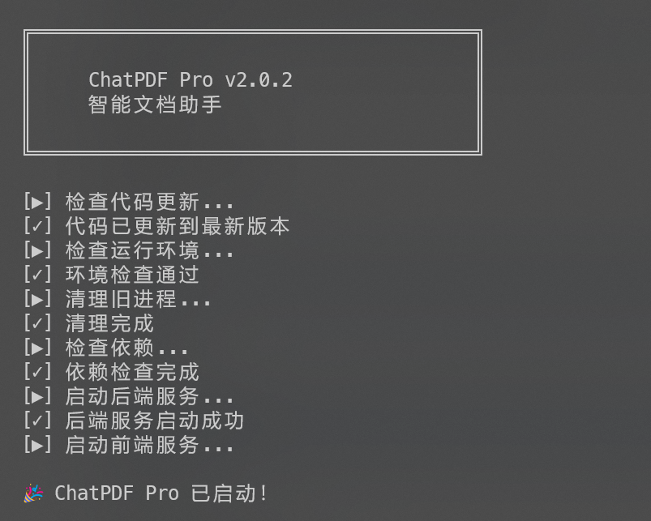

# ChatPDF 2.0.3 - Healing AI Document Assistant

<div align="center">


[](LICENSE)
[](https://vitejs.dev/)
[](https://reactjs.org)
[](https://www.python.org)

**[中文](README.md)** | **English**

**The All-New ChatPDF 2.0.3**: Healing Blue UI, Blazing Fast Vite, and Free Local Model Support!

[Quick Start](#quick-start) • [New Features](#-new-features) • [Tech Stack](#-tech-stack) • [Docs](#-docs)

</div>

---

## ✨ New Features (v2.0)

### 🎨 Healing Blue UI
- **Visual Excellence**: Featuring a calming `#F6F8FA` → `#E9F4FF` gradient background with high-saturation blue accents.
- **Floating Glass Cards**: Content floats in beautiful glassmorphism cards with smooth animations.
- **Modern Aesthetics**: Deeply optimized UI for a refreshing, tech-savvy feel.
- **Dark Mode**: Toggle between Light and Dark themes for comfortable reading at night.

### ⚡ Blazing Performance
- **Powered by Vite 6.0**: 10x faster startup and millisecond-level HMR.
- **React 18.3**: Leveraging the latest concurrent features for silky smooth interactions.

### 🦙 Local Model Support (Free!)
- **Ollama Integration**: Native support for **Llama 3**, **Mistral**, **Qwen**, and more.
- **Privacy First**: Run AI locally on your machine. Your data never leaves your device.

### 📸 AI Vision Analysis
- **Smart Screenshot**: Capture full pages or select specific areas.
- **Multimodal Analysis**: Support for GPT-4o, Claude 3.5 Sonnet, Gemini 1.5 Pro.
- **Chart Understanding**: Accurately recognize charts, formulas, and table data.

### 🛠 Productivity Boosts (2.0.3)
- **Draggable & Resizable Selection Toolbar**: Move it anywhere; resize from all four corners.
- **Custom Search Engine Template**: Choose preset engines or input your own URL with `{query}` placeholder.

---

## 🚀 Quick Start

### Option 1: One-Click Start (Recommended)

**Windows:**
```bash
start.bat
```

**Linux/Mac:**
```bash
chmod +x start.sh
./start.sh
```

### One-Click Start UI (Preview)



> `start.bat` / `start.sh` will check for updates, install dependencies, start backend/frontend, and open the browser automatically. Closing the terminal stops all services.

### Option 2: Manual Start

**1. Start Backend**
```bash
cd backend
pip install -r requirements.txt
python app.py
```
*Backend runs at: http://localhost:8000*

**2. Start Frontend**
```bash
cd frontend
npm install
npm run dev
```
*Frontend runs at: http://localhost:3000*

---

## 🔧 Model Configuration

### 1. Online Models (API Key)
Supports major AI providers:

| Provider | Sample Models | Vision | Notes |
|----------|---------------|--------|-------|
| OpenAI | GPT-4o, GPT-4 Turbo, GPT-4o Mini | ✓ | Best multimodal experience |
| Anthropic | Claude 4.5 Sonnet, Claude 3 Opus | ✓ | Great long-context |
| Google | Gemini 2.5 Pro, Gemini 2.5 Flash | ✓ | Cost-effective |
| Grok (xAI) | Grok 4.1, Grok Vision | ✓ | xAI models |
| Qwen (DashScope) | qwen-max, qwen-long, qwen-vl | Partial | Lower cost, long docs |
| Doubao (Volcano) | doubao-1.5-pro-256k | Partial | Good price in CN |
| MiniMax | abab6.5 chat/s-chat | ✗ | OpenAI-compatible API |
| Ollama | Llama 3, Qwen, Mistral | ✗ | Local, free |
| Custom OpenAI-compatible | Any `chat/completions` compatible | Depends | Set custom base_url + API Key |

### 2. Local Models (Ollama)
1. Download and install [Ollama](https://ollama.com/)
2. Pull a model: `ollama pull llama3`
3. Select **Provider: Local (Ollama)** in ChatPDF Settings.

---

## 🔄 Auto-Update

ChatPDF supports automatic version detection and one-click upgrades!

### How to Upgrade

**Windows:**
```bash
update.bat
```

**Mac/Linux:**
```bash
chmod +x update.sh   # First time only
./update.sh
```

**How it works**:
- Automatically checks GitHub for new versions on startup
- Displays a blue update banner when a new version is available
- Click "One-Click Upgrade" to run the update script
- Script automatically executes `git pull` + dependency updates

---

## 📝 Mac Complete Commands

```bash
# First-time setup (grant permissions)
chmod +x start.sh update.sh stop.sh

# Start application
./start.sh

# Upgrade version
./update.sh

# Stop services
./stop.sh
```

---

## 🛠 Tech Stack

### Frontend (v2.0)
- **Build Tool**: Vite 6.0
- **Framework**: React 18.3
- **Styling**: Tailwind CSS 3.4 + Framer Motion (Animations)
- **Rendering**: React Markdown + KaTeX (Math) + Highlight.js (Code)
- **PDF & Toolbar**: react-pdf, draggable/resizable text selection toolbar (four-corner resize)

### Backend
- **Framework**: FastAPI 0.115+
- **AI Orchestration**: LangChain 0.3
- **PDF Processing**: PyPDF2 + pdfplumber
- **Vector Search**: FAISS + Sentence Transformers

---

## 📄 License

This project is licensed under the [MIT License](LICENSE).

<div align="center">
Made with ❤️ by ChatPDF Team
</div>
