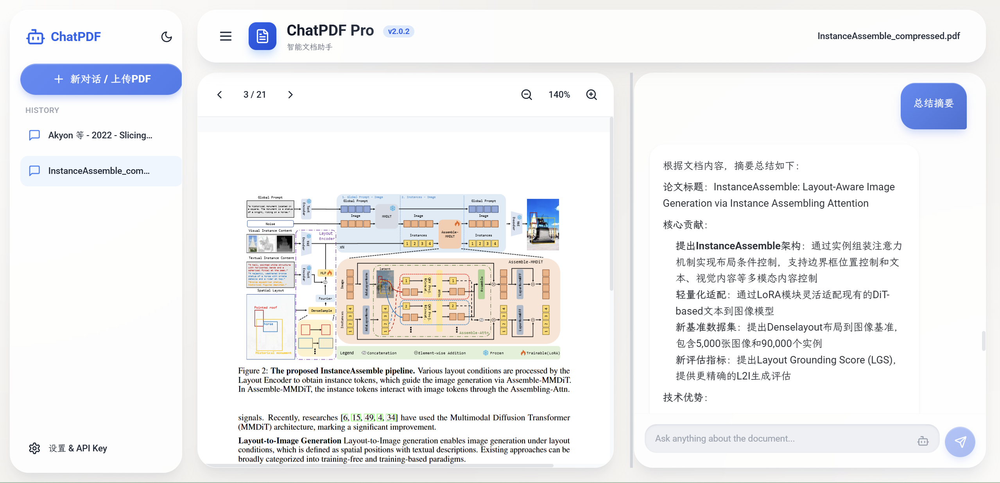

# ChatPDF Pro v3.0.1

<div align="center">


[](LICENSE)
[](https://reactjs.org)
[](https://www.python.org)

**Smart Document Assistant - Chat with your PDFs** · [中文](README.md)

[Quick Start](#quick-start) • [Features](#core-features) • [What's New in v3.0.1](#whats-new-in-v301) • [Tech Stack](#tech-stack) • [Architecture](#architecture)

</div>

---

## App Preview



*Professional PDF reading and AI chat interface with native PDF rendering, conversation history, and intelligent text extraction.*

### Standalone Desktop Client

A self-contained Windows desktop application built with Electron. The Python backend is fully integrated and packaged using PyInstaller, ensuring it works **out of the box without any Python or Node.js environment configuration.**

---

## What's New in v3.0.1

### Desktop Architecture (Electron)
- **Standalone Application** - Windows desktop client built on Electron 26, breaking free from browser limitations.
- **One-Click Installation** - Provided as an NSIS installer. Just double-click to install and run.
- **Embedded Backend** - FastAPI backend packaged with PyInstaller. The app's process manager automatically finds an available port and spawns the backend service upon startup.

### Deep Thinking Mode
- **Reasoning Visualization** - Real-time display of the AI's ThinkingBlock in the chat area, with manual collapse/expand support.
- **Adjustable Intensity** - Dynamically adjust reasoning intensity (Low, Medium, High) in chat settings.
- **Smooth Streaming** - Both thinking processes and final responses support RequestAnimationFrame-based smooth character-by-character rendering.

### Math Formula Rendering
- **Dual Engines** - Built-in KaTeX and MathJax engines. Users can switch between them or disable rendering entirely via settings.
- **Single Dollar Support** - Renders inline math with `$...$`, resolving conflicts between plain text and formula syntax.
- **LaTeX Bracket Conversion** - Employs a balanced matching algorithm to automatically convert `\[...\]` and `\(...\)` into standard Markdown math syntax.

### Connectivity & UI Optimization
- **Web Search** - Allows the AI to fetch real-time internet information, displaying clear source links at the bottom of the response.
- **Render Performance** - Implements Virtual List scrolling, maintaining 60fps performance even with extensive, text-heavy conversation histories.
- **DOM Direct-Write** - Bypasses React state updates during streaming output by directly modifying DOM nodes via refs, significantly reducing memory and CPU footprint.

---

## Core Features

### PDF Document Processing
- **Native Rendering** - High-fidelity document display via PDF.js with smooth zooming, pagination, and text selection.
- **Multimodal Extraction** - Uses `pdfplumber` for high-quality text extraction, accurately recognizing complex multi-column layouts.
- **Structural Parsing** - Automatically detects and extracts PDF tables, converting them into Markdown structures easily understood by LLMs.

### Intelligent Retrieval (RAG v3.0)
- **Semantic Groups** - Aggregates scattered text chunks into semantically coherent units of ~5000 characters, respecting page, heading, and table boundaries.
- **Three-Level Granularity** - Automatically generates Summary (80 chars), Digest (1000 chars), and Full text representations for every semantic group.
- **Dynamic Granularity Matching** - Leverages LLMs to infer user intent (e.g., overview, extraction, specific data) during retrieval, automatically returning the optimal text granularity.
- **Token Budget Control** - Estimates token counts accurately based on target models and character properties (Chinese vs. English). Triggers intelligent granularity degradation instead of hard truncation when approaching context limits.
- **Dual-Index Retrieval** - Queries both chunk-level and group-level FAISS vector indexes simultaneously, combining with BM25 algorithms and RRF (Reciprocal Rank Fusion) for reranking.

### AI Chat Capabilities
- **Multi-Model Support** - Native integration with OpenAI, Anthropic, Google Gemini, Grok, and local Ollama models.
- **Precise Citations** - Automatically generates [1], [2] inline citations. Clicking a citation highlights the source in the PDF view and scrolls smoothly to the exact page.
- **Text Selection Toolbar** - Selecting text in the PDF triggers a floating toolbar for instant AI explanation, translation, or inclusion as context for the next query.
- **Visual Diagrams** - Automatically parses and renders Mermaid code blocks generated by the AI, perfect for flowcharts and mind maps.

---

## Quick Start

### Option 1: Download Desktop Client (Recommended)

Download the latest `.exe` installer directly from the [Releases](https://github.com/juyou4/ChatPDF-Pro/releases) page.
Install and double-click the desktop icon to run. No environment setup required.

### Option 2: Run from Source (Web Mode)

**1. Backend Service (Python 3.10+)**
```bash
cd backend
pip install -r requirements.txt
python app.py
```

**2. Frontend Service (Node.js 18+)**
```bash
cd frontend
npm install
npm run dev
```
Visit `http://localhost:3000` to start using the application.

---

## Tech Stack

### Frontend
- **Core**: React 18 + Vite 6 + Tailwind CSS
- **PDF Rendering**: react-pdf 9.0 + PDF.js
- **UI Animation**: Framer Motion
- **Markdown**: ReactMarkdown + rehype-katex / rehype-mathjax
- **Desktop Environment**: Electron 26 + electron-builder

### Backend
- **Framework**: FastAPI 0.115 (Uvicorn async driven)
- **PDF Processing**: pdfplumber
- **Vector Database**: FAISS
- **Retrieval Architecture**: Semantic Groups + Dual-Index RRF Fusion
- **Model SDKs**: OpenAI, Anthropic, Google Generative AI

---

## Architecture

```text
ChatPDF/
├── frontend/                    # React frontend
│   ├── src/
│   │   ├── components/
│   │   │   ├── ChatPDF.jsx          # Main application component
│   │   │   ├── PDFViewer.jsx        # PDF rendering core
│   │   │   ├── StreamingMarkdown.jsx # Markdown + Math + Mermaid rendering
│   │   │   ├── ThinkingBlock.jsx    # Deep thinking visualizer
│   │   │   ├── ChatSettings.jsx     # Chat parameter configuration
│   │   │   ├── VirtualMessageList.jsx # Virtualized scroll list
│   │   │   ├── PresetQuestions.jsx   # Quick action buttons
│   │   │   └── CitationLink.jsx     # Interactive citation links
│   │   ├── contexts/
│   │   │   ├── ChatParamsContext.jsx # Chat parameters (incl. Math Engine)
│   │   │   ├── GlobalSettingsContext.jsx
│   │   │   └── WebSearchContext.jsx  # Web search state
│   │   ├── hooks/
│   │   │   ├── useMessageState.js    # Message state & streaming requests
│   │   │   └── useSmoothStream.js    # Smooth streaming orchestrator
│   │   └── utils/
│   │       └── processLatexBrackets.js # Balanced LaTeX bracket parser
│   ├── package.json
│   └── vite.config.js
├── backend/                     # FastAPI backend
│   ├── app.py                   # Main application entry
│   ├── desktop_entry.py         # PyInstaller frozen entry point
│   ├── routes/                  # API routing layer
│   ├── services/
│   │   ├── semantic_group_service.py  # Semantic group chunking
│   │   ├── hybrid_search.py           # Hybrid retrieval + RRF fusion
│   │   ├── context_builder.py         # Prompt assembly & citation generation
│   │   ├── chat_service.py            # AI chat logic & thinking stream handler
│   │   ├── web_search_service.py      # Internet search engine integration
│   │   ├── embedding_service.py       # Embedding calculation & FAISS indexing
│   │   └── rerank_service.py          # Cross-encoder reranking
│   └── requirements.txt
├── electron/                    # Electron desktop environment
│   ├── src/main.ts              # Main process: Window mgmt, Backend spawner
│   └── package.json
├── scripts/                     # Cross-platform build scripts
└── README.md
```

---

## FAQ

**Q: The desktop client launches with a blank screen or throws an error?**
A: Ensure no system proxy is intercepting localhost traffic, or try running as Administrator. On first launch, the app silently starts the Python engine in the background, which may take a few seconds.

**Q: PDF doesn't display in Web mode?**
A: Verify the backend service is running (default port 8000). Check the browser console for CORS or network interception errors.

**Q: API calls fail or timeout?**
A: Check if your API Key format is correct. Ensure your network environment can reach the provider's endpoint (e.g., OpenAI may require specific network routing or a custom base URL proxy).

**Q: Connection refused when using local models (Ollama)?**
A: Ensure the Ollama background service is running and you have set the system environment variable `OLLAMA_ORIGINS="*"` to allow Cross-Origin requests.

**Q: Math formulas are rendering as garbage text?**
A: Switch between KaTeX and MathJax in the settings panel (bottom left). KaTeX is faster, while MathJax offers better compatibility for complex nested LaTeX.

---

## Changelog

### v3.0.1 (Current)
- **Desktop Client Release**: Full Windows standalone application packaged via Electron 26 and PyInstaller.
- **Deep Thinking Enhancements**: Introduced `ThinkingBlock` for multi-tier reasoning visualization and smooth collapsing.
- **Math Engine Iteration**: Support for hot-swapping between KaTeX and MathJax, resolving rendering crashes on complex LaTeX.
- **Render Optimization**: Rewrote `StreamingMarkdown`'s underlying logic to use DOM Ref direct-writes, bypassing React reconciliation overhead. Added virtual lists to eliminate lag in extensive histories.

### v3.0.0
- **RAG Architecture Rewrite**: Introduced Semantic Groups and a three-tier granularity (Full/Digest/Summary) degradation strategy.
- **Precise Token Accounting**: Dynamic budget system based on language character properties.
- **Dual-Track Retrieval**: Combined group-level and chunk-level FAISS vector retrieval with RRF fusion.

---

## Acknowledgments

The RAG retrieval pipeline in this project, specifically the concepts of "Semantic Groups" and "Multi-level Granularity Auto-degradation," was inspired by the design philosophy of [Paper Burner X](https://github.com/Feather-2/paper-burner-x). See [THIRD_PARTY_NOTICES.md](THIRD_PARTY_NOTICES.md) for details.

## License

This project is licensed under the MIT License - see the [LICENSE](LICENSE) file for details.
